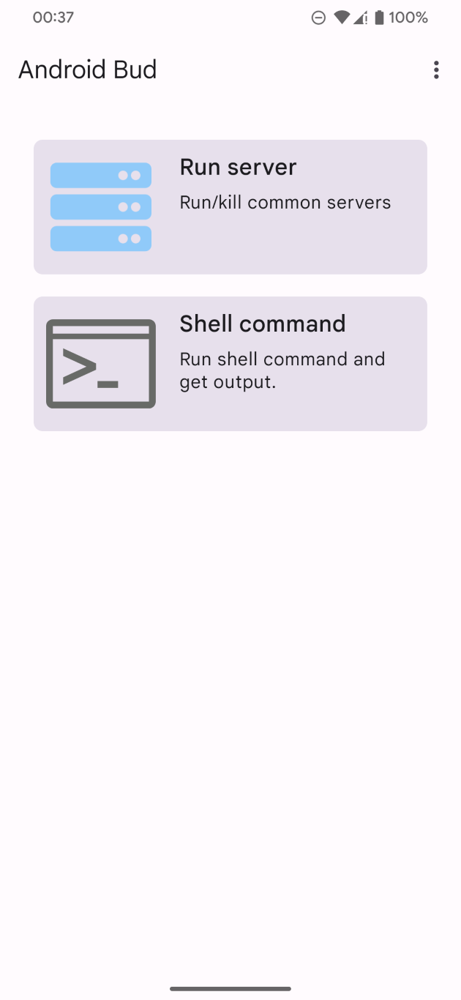
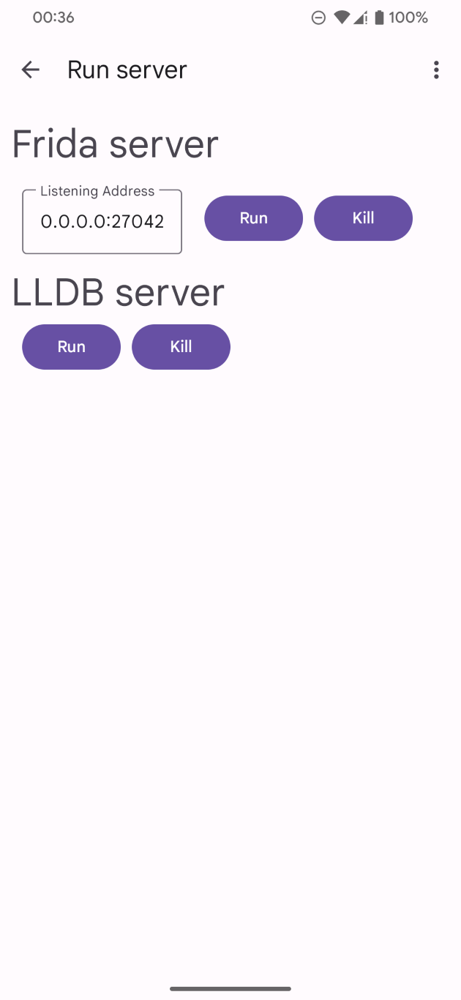
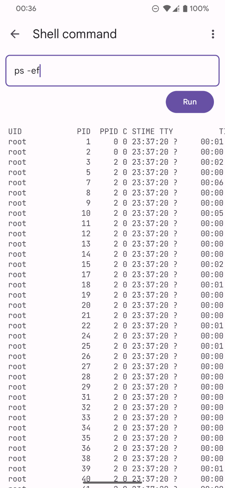

# Android Bud

**A**ndroi**d** **B**ud is a tool to assist you in Android reverse enginnering.

## Features

* Control clipboard with **adb**

* Run common tool servers (Frida, LLDB)

* Run shell commands

## Screenshots

|  |  |  |
| --------------------------------- | ---------------------------------------- | ------------------------- |